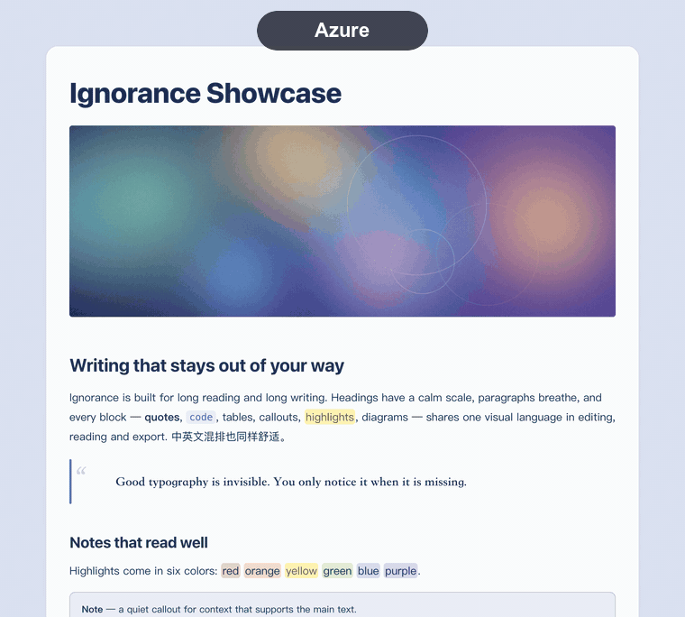
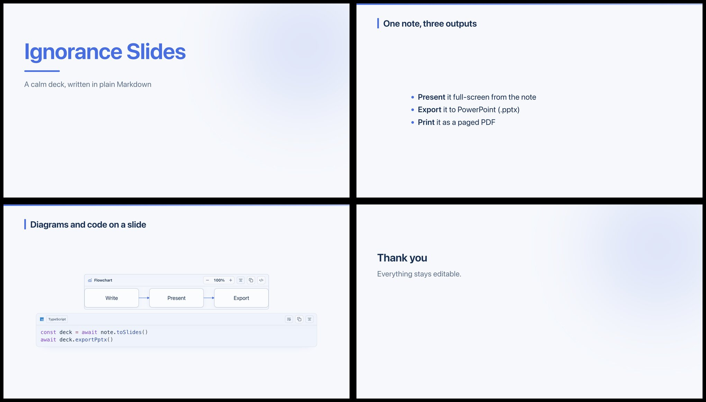
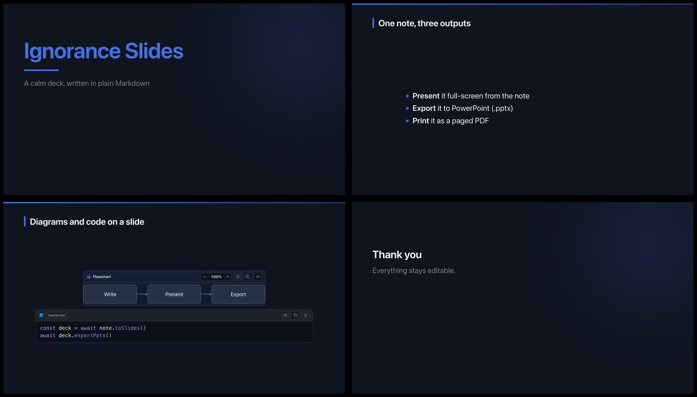
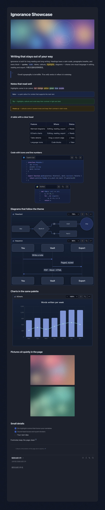

<div align="center">

# Ignorance Advanced

**The companion plugin for the [Ignorance theme](https://community.obsidian.md/themes/ignorance):** diagrams, tables, images, presentations and exports in one place.

[中文](README.md) · [Support](#support)





</div>

> The theme owns the look; the plugin adds what CSS cannot do. It works with other themes too, but its controls are designed around the theme's tokens and look plainer without it.

## Palettes: eight, one click

Choose Azure, Pine, Book, Graphite, Terracotta, Teal, Wisteria or Amber in the plugin settings, each tuned for light and dark (see the animations above).

## Features

### Mermaid enhancement
Mermaid 12 (with ELK layout and ZenUML), recolored to the active theme and palette in light and dark. Each diagram has zoom, copy / edit source, left / center / right placement and drag-to-resize width (saved on the fence as `{align=center} {width=560}`).

### ECharts enhancement
Apache ECharts blocks render in place, follow the theme palette, and share the same controls as Mermaid.

### Table enhancement
Drag column and row edges with detents (fit-to-content or equal share; Alt drags freely, Shift steps by 10 px). A size menu fits all columns, equalizes, fills the text width or resets; double-click an edge to fit it; left / center / right placement. Buttons appear on hover and work on mobile.

### Presentations (PPT)
Turn any note into a deck with `---` between slides: full-screen presenting, diagrams and code blocks carried onto the slide as-is, **PPTX export**, or a paged PDF. The note stays plain Markdown and editable.

<div align="center">
 
</div>

### Code blocks
A searchable language picker (type `py`, `ts`, `sql`), 130+ languages, language icons, line numbers, copy, soft wrap. The file explorer gets Material Icon Theme file icons, with distinct open, closed and empty folders.

### Images
Align, resize with eight handles, copy, remove, and **crop** (then replace the original or add a new image).

### Reading and export
A page toolbar (content width, paper size, margins, page numbers, a paged view that matches PDF output). Export to PDF, Word, PowerPoint, images, and a standalone offline HTML reader with table of contents, search and a light/dark switch.

### And more
Tab reuse, typewriter and focus modes, smart punctuation, `==🟢colored==` highlights, web clipping, and Markdown import from Word, PDF, Excel, PowerPoint and more (desktop).

## Long preview

<div align="center">
 
</div>

## Install

- **Community plugins**: Settings → Community plugins → Browse → search "Ignorance Advanced". ([plugin page](https://community.obsidian.md/plugins/ignorance-advanced))
- **Manual**: download `main.js`, `manifest.json` and `styles.css` from the [latest release](https://github.com/ignorance-shiyao/obsidian-ignorance-advanced/releases/latest) into `<vault>/.obsidian/plugins/ignorance-advanced/`, then enable it.
- **Theme**: install [Ignorance](https://community.obsidian.md/themes/ignorance) from Settings → Appearance for the full look.

Requires Obsidian 1.8.7 or later. Works on desktop and mobile; Word/PDF import and some exports need the desktop app.

## Usage

- **Diagrams and charts**: write a fenced block with the language `mermaid` or `echarts`. It renders in Live Preview and Reading view; hover it for zoom, copy, edit-source and alignment controls, and drag its edges to resize.
- **Tables**: drag a column or row edge to resize; Alt drags freely, Shift steps by 10 px, double-click an edge to fit it.
- **Images**: click an image to align, resize or crop it.
- **Code blocks**: click the language label to search the language list; line numbers and soft wrap are in the block toolbar.
- **Presentations**: separate slides with a line containing `---`, then use the *Presentation* button in the page toolbar at the top of the note (or run *Open presentation mode* from the command palette).
- **Export**: use the export button in the page toolbar to produce PDF, Word, PowerPoint, images or an offline HTML reader.
- **Settings**: Settings → Ignorance Advanced (palette, page layout, highlight colors, tab behavior).

## Privacy and network use

- No telemetry, no analytics, no ads.
- Nothing is downloaded or updated by the plugin itself. All libraries (Mermaid, ECharts, the export engines…) are compressed inside `main.js`, which is why it is about 8 MB, and are unpacked only when a feature needs them.
- Network requests happen only when you ask for them: fetching a web page you clip, an image URL you export or copy, or a cover image URL you set in a note.

## Build from source

```bash
npm install
npm run build          # writes dist/main.js, dist/styles.css, dist/manifest.json
npm test
OBSIDIAN_VAULT=/path/to/vault npm run install:vault   # build and copy into a vault
```

## Feedback

If you run into a problem or want a feature, please [open an issue](https://github.com/ignorance-shiyao/obsidian-ignorance-advanced/issues). A screenshot, your Obsidian version and the platform (desktop or mobile) help a lot.

## Support

If this is useful to you, you can buy me a coffee. Thank you!

| WeChat | Alipay |
| --- | --- |
|  |  |

## License

[MIT](LICENSE). Third-party software is listed in [THIRD_PARTY_NOTICES.md](THIRD_PARTY_NOTICES.md); license texts are in [`licenses/`](licenses).
